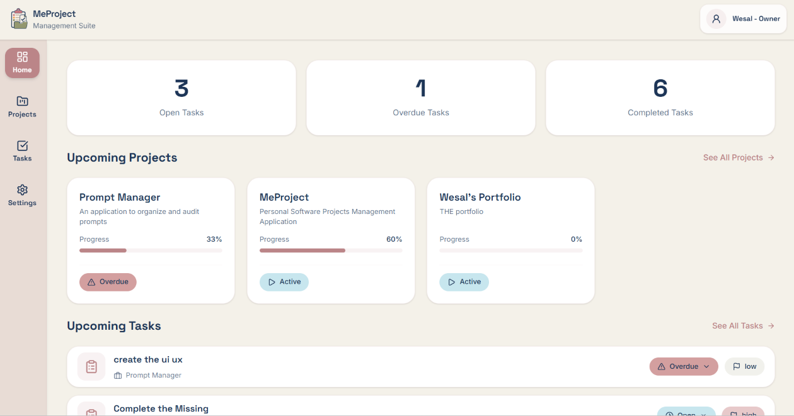
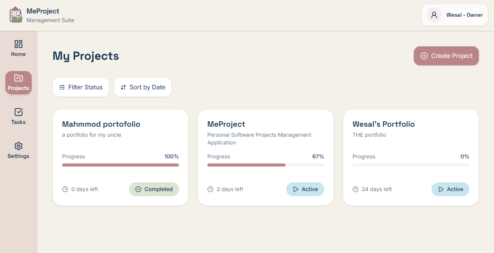
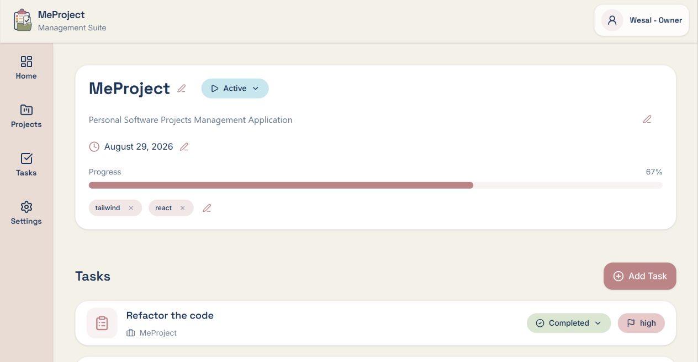

# MeProject

## Description

MeProject is personal project management desktop application, it provides a simple workspace for creating and managing projects, tracking tasks, adding notes, and monitoring project progress.

## Live Demo

[View the live project](https://me-project99-seven.vercel.app/)

## Features

* Create, update, and delete projects
* Create, update, and delete tasks
* Add and manage notes for tasks
* Add and manage attachments for projects
* Update task status
* Activate and cancel projects
* Filter tasks by status and priority
* Sort tasks by due date
* Paginate tasks
* View project progress based on task completion
* User registration and login
* Explore the application with demo data
* Change account name
* Change password using a recovery key
* Delete account
* Loading states with skeletons and spinners
* Error handling with error card displays
* Empty states for pages without data
* Animated intro screen
* Social media preview metadata

## Technologies Used

* React
* TypeScript
* Vite
* Tailwind CSS
* React Router DOM
* Axios
* Day.js
* Lucide React
* Motion
* REST API
* JSON Web Tokens (JWT)
* Google Cloud Run (Backend)
* Vercel (Frontend)

## Backend

The backend REST API used by this project was fully AI-generated.
My work on this project focused on the frontend application, including the UI, state management, API integration, authentication flow, reusable components, and overall frontend architecture.

For full API details, endpoints, and request/response structures, see [backend/API_DOCUMENTATION.md](./backend/API_DOCUMENTATION.md).

## Deployment

This project uses an automated deployment setup where updates to GitHub instantly push live to production:

- **Frontend**: Hosted on **Vercel**.
- **Backend**: Hosted on **Google Cloud Run**
> **Note:** The database is stored within the backend environment, which may cause data to reset or not persist reliably when the application is redeployed or restarted. This setup was intentionally chosen for this portfolio project to keep the infrastructure simple and minimize costs. A persistent external database would be more appropriate for a production application.

## What I Learned

While building this project I practiced:

* Building a React application with TypeScript
* Designing reusable React components
* Managing application-wide authentication state with React Context
* Creating custom hooks for reusable data-fetching logic
* Working with REST APIs using Axios
* Designing TypeScript types for application and API data
* Integrating authentication with JWT
* Managing loading and error states
* Implementing CRUD operations
* Working with URL search parameters for filtering, sorting, and pagination
* Separating API logic from UI components
* Managing state and data flow between pages and components
* Building reusable modals, cards, buttons, badges, and form components
* Creating responsive layouts with Tailwind CSS
* Integrating a frontend with an existing REST API
* Deploying a frontend application with Google Cloud Run
* Connecting GitHub with automatic deployment
* Understanding frontend and backend responsibilities
* Making engineering decisions around component reuse, state management, and separation of concerns

## Screenshots

### Dashboard

### Projects

### Project Details

### Tasks

### Task Details

